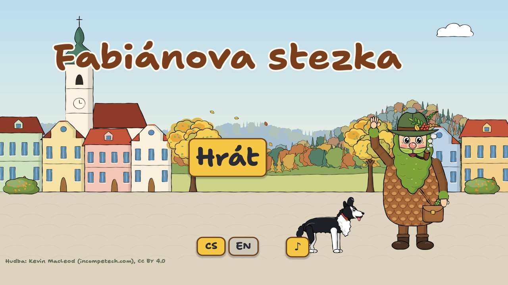
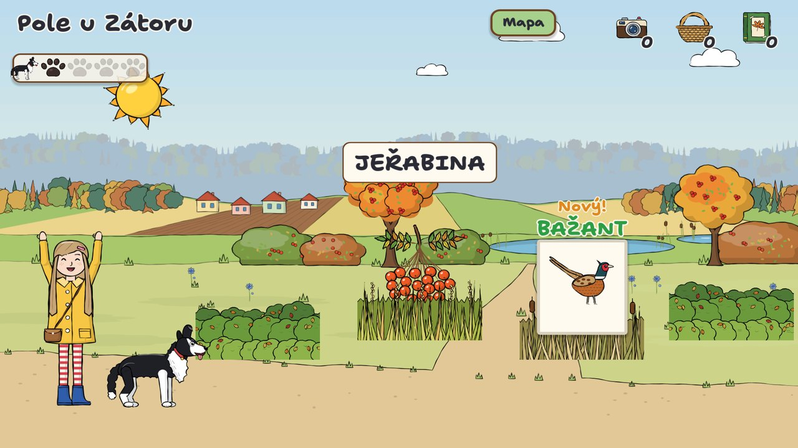
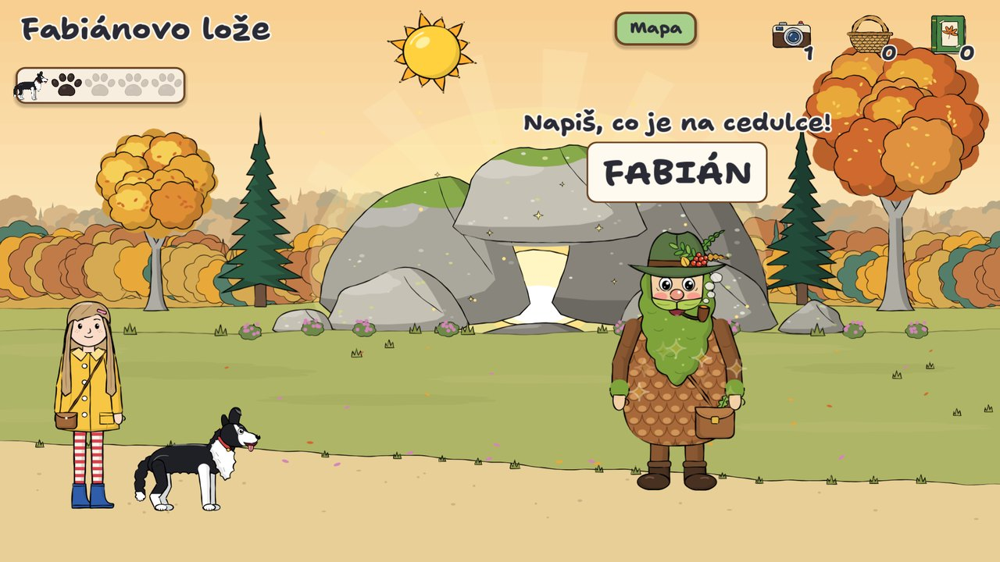
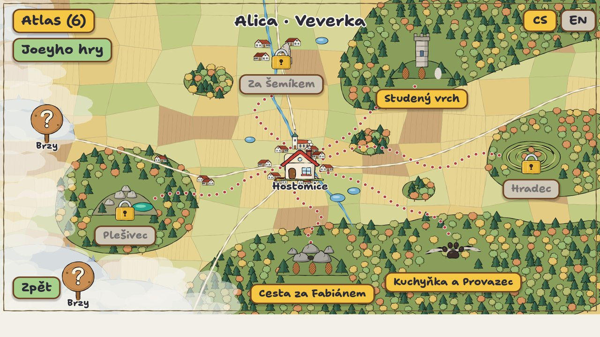
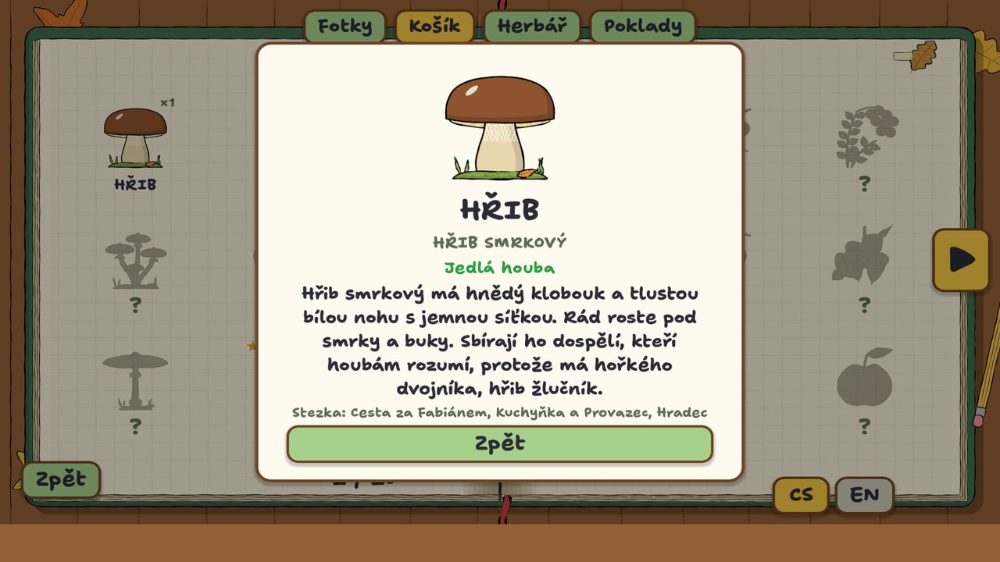
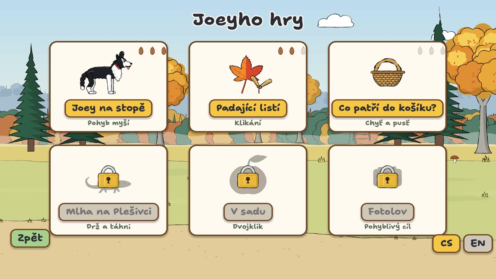
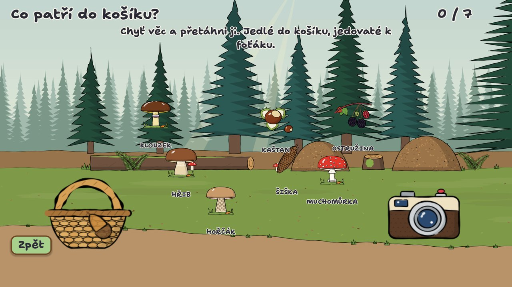

<div align="center">

# Fabiánova stezka · Fabian's Trail

**A cosy nature-walk typing game for young children, set in the Brdy hills of the Czech Republic.**

Walk real autumn trails with Joey the dog. Deer, mushrooms, berries and wildflowers peek out from behind bushes and
rocks, and typing their names collects them into your nature atlas. At the end of every trail waits Fabián, the kind
old forest spirit of Brdy.

Czech 🇨🇿 and English 🇬🇧 · made with [Godot 4](https://godotengine.org) · plays in the browser, on Linux and on Windows

**[▶ Play on itch.io](https://redricko.itch.io/fabians-trail)** · **[🌲 Game website](https://antas.cz/fabians-trails/)**



</div>

---

## What it is

*Fabiánova stezka* was made for two little girls, one who is learning to read and one who can't read yet, and
for walks through the woods where they actually live. Everything in the game is real: the trails start on the
Hostomice town square, the places are real places in the Brdy hills, and every animal, mushroom and plant is one you
can find there in autumn.

There is no way to lose. If you're too slow, the animal simply hides again. The sun moving across the sky is the
only clock, and every trail ends with Fabián.

<table>
<tr>
<td></td>
<td></td>
</tr>
<tr>
<td align="center"><sub>Type the name before it hides. New finds are marked <i>Nový!</i></sub></td>
<td align="center"><sub>Fabián waits at the end of every trail</sub></td>
</tr>
</table>

## How to play

- **Type what's on the sign.** The first letter picks a target, and a typo never loses your progress. **Esc** or
  **Backspace** lets go of the word you're on.
- **Each find does something different:**

  | Find | Action | Goes into |
  |---|---|---|
  | Animals | 📷 photo | Photos |
  | Poisonous mushrooms | 📷 photo only, *nesahat!* (don't touch!) | Photos |
  | Edible mushrooms, berries, nuts | 🧺 picked | Basket |
  | Flowers, leaves, ferns | 📖 pressed | Herbarium |

- **Joey's paws.** Four finds in a row without a typo fill Joey's paw meter. Joey then runs off to sniff out something
  rare, such as a stag, a fire salamander or a pygmy owl.
- **Cones and keepsakes.** Fabián rewards each trail with 1–3 cones and a keepsake: his lucky cone, a silver coin,
  a horseshoe…
- **Three ranks**, chosen per player:

  | Rank | Types | For |
  |---|---|---|
  | 🦔 Ježek / Hedgehog | the first letter, with a glowing on-screen keyboard and every name spoken aloud | children who can't read yet |
  | 🐿️ Veverka / Squirrel | short names: *HŘIB*, *SQUIRREL* | early readers |
  | 🦉 Sova / Owl | full names with exact accents: *HŘIB SMRKOVÝ*, *EURASIAN JAY* | confident readers |

## What's inside

- **6 trails** from Hostomice: Cesta za Fabiánem, Studený vrch, Kuchyňka a Provazec, Plešivec, Za Šemíkem and
  Hradec. Each has 3–4 stops and ends at a real landmark: Fabiánovo lože, the Studený vrch lookout tower, the
  mysterious stone wall, the emerald pond, Šemík's grave and a Celtic hillfort.
- **66 species** in the atlas. Every card has a short factsheet for children, read aloud in Czech or English.
- **Joey's games:** six mouse mini-games that teach mouse skills step by step:

  | Game | Skill |
  |---|---|
  | Joey on the trail | moving the mouse |
  | Falling leaves | clicking |
  | What goes in the basket? | drag and drop, plus a mushroom safety lesson |
  | Fog on Plešivec | hold and move |
  | In the orchard | double click |
  | Photo hunt | moving targets |

- **One language at a time.** Switch between Czech and English whenever you like. The language you choose is the
  one you type and hear.
- **Voices and music:** every line is voiced, with calm music and a forest ambience underneath.

<table>
<tr>
<td></td>
<td></td>
</tr>
<tr>
<td></td>
<td></td>
</tr>
</table>

## Play

Play it in the browser or download it for Linux and Windows on **[itch.io](https://redricko.itch.io/fabians-trail)**, or run it from source:

```sh
# Godot 4.6.3 (standard build, not .NET)
godot --path game
```

## Development

| | |
|---|---|
| Engine | Godot 4.6.3, GDScript only, GL Compatibility renderer, no plugins |
| Art | Drawn in code with Python and reportlab (`art/`), exported to PNG |
| Voices | Piper neural text-to-speech, generated from the game's data files |
| Data | Plain text files that are easy to edit: species, trails and facts in `game/data/` |

```sh
godot --headless --path game res://tests/run.tscn          # run the tests
tools/build_web.sh                                         # web export → build/web/
art/.venv/bin/python art/export_assets.py [--module name]  # redraw art, then reimport
tools/make_voice.sh                                        # regenerate all voice lines
```

To add a species, add a line to `game/data/atlas.txt` (`id | cs | en | cs long | en long | category`), a fact to
`game/data/facts_*.txt`, and a drawing to the matching `art/` module. Then add its id to a trail in
`game/data/trails/`. The tests check that names avoid dead-key letters (Ď Ť Ň Ó), that every entry has art, a
fact and a voice, and that every trail can be played to the end at every rank and in both languages.

```
game/          Godot project: scripts/, data/, assets/, tests/
art/           Python drawing code, one module per group
tools/         web build, local server, voice generation
docs/          screenshots
```

## Credits

- **Idea, places and testing:** a dad from Hostomice and his two daughters
- **Legend:** Fabián, the forest spirit of Brdy, from local folklore as collected by Jan Čáka and others
- **Music:** Kevin MacLeod ([incompetech.com](https://incompetech.com)): *Porch Swing Days (slower)*, *Lasting Hope*
  and *Dreamer*. Licensed under [CC BY 4.0](https://creativecommons.org/licenses/by/4.0/).
- **Voices:** generated with [Piper](https://github.com/OHF-Voice/piper1-gpl):
  - Czech voice *jirka* (dataset CC0)
  - English voice *alba*, from the University of Edinburgh CSTR dataset
    ([CC BY 4.0](https://creativecommons.org/licenses/by/4.0/))
- **Fonts:** Shantell Sans, Patrick Hand, Comic Neue and Bangers, all under the
  [SIL Open Font License](https://openfontlicense.org)
- **Built with** [Godot Engine](https://godotengine.org) (MIT)

## License

Code is released under the MIT License. Artwork, texts and game data are released under
[CC BY 4.0](https://creativecommons.org/licenses/by/4.0/). See [LICENSE](LICENSE). Third-party music, voices and
fonts keep their own licences, listed above.
